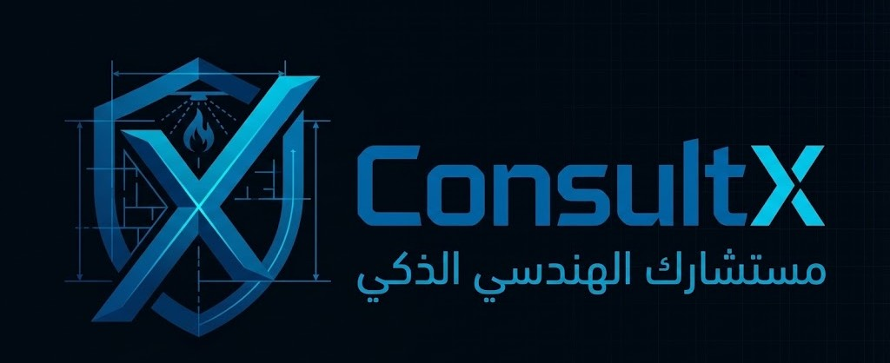
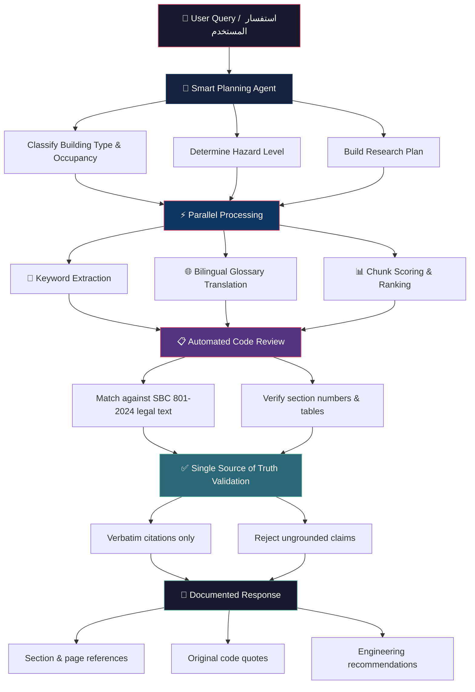

# ConsultX — مستشارك الذكي للسلامة من الحريق

> AI-powered fire safety consulting tool for the Saudi Building Code



---

## Overview

**ConsultX** is an intelligent, chat-based consulting assistant specializing in fire safety requirements under the Saudi Building Code (SBC). It retrieves and cites relevant code sections from **SBC 201** (Building Code), **SBC 801** (Fire Code), and related **NFPA / SFPE** standards to deliver grounded, reference-backed answers — not generic AI guesses.

---

## Key Features

| Feature | Description |
|---|---|
| 🔍 **Standard Mode** | Quick, concise answers with code citations |
| 📊 **Analysis Mode** | Step-by-step technical breakdown with detailed reasoning |
| 🌐 **Bilingual Support** | Full Arabic (RTL) and English (LTR) interface and responses |
| 📖 **Verbatim Citations** | Direct quotes from SBC sections, tables, and clauses |
| 💬 **Conversation History** | Save, load, and delete past consulting sessions |
| 🔐 **User Authentication** | Email/password signup and login |

---

## Tech Stack

- **Frontend:** React 18, TypeScript, Vite, Tailwind CSS, shadcn/ui
- **Backend:** Lovable Cloud (Edge Functions, Database, Storage, Auth)
- **AI Model:** Google Gemini 2.5 Pro via Lovable AI Gateway
- **Fonts:** Cairo, IBM Plex Sans Arabic

---

## Architecture

```
┌─────────────────────────────────────────────┐
│                  Frontend                   │
│         React SPA (Home / Auth / Chat)      │
└──────────────────┬──────────────────────────┘
                   │
                   ▼
┌─────────────────────────────────────────────┐
│          Edge Function: fire-safety-chat    │
│                                             │
│  1. Extract keywords from user question     │
│  2. Translate Arabic → English (glossary)   │
│  3. Load SBC chunks from Storage            │
│  4. Score & rank chunks against query       │
│  5. Send top matches + question to AI model │
│  6. Stream grounded answer back to client   │
└──────────┬────────────────┬─────────────────┘
           │                │
           ▼                ▼
    ┌────────────┐    ┌──────────────┐
    │  Storage   │    │ Database     │
    │ SBC 201    │    │ Conversations│
    │ SBC 801    │    │ Messages     │
    │ (chunks)   │    │ Users        │
    └────────────┘    └──────────────┘
```

---

## How It Works — كيف يعمل النظام

### Pipeline Flowchart



### Step-by-Step Breakdown

| Stage | Description |
|---|---|
| **1. Request Reception** | The user submits a fire safety question in Arabic or English |
| **2. Smart Planning** | An AI planning agent classifies the building type, occupancy group, and hazard level to construct a targeted research plan |
| **3. Parallel Retrieval** | The system simultaneously extracts keywords, translates terms via a bilingual glossary (~90 terms), and scores SBC document chunks against the query |
| **4. Code Compliance Review** | Matching chunks are validated against the official SBC 801-2024 legal text — section numbers, table references, and clause details are verified |
| **5. Single Source of Truth** | Only verbatim citations from stored SBC documents are accepted; ungrounded or paraphrased claims are rejected |
| **6. Documented Response** | The final answer includes exact page numbers, section references, and original code quotes to ensure legal-grade accuracy |

### Design Principles

- **🎯 Single Source of Truth** — Every answer is grounded in actual SBC text stored in the system; no external or fabricated references
- **🚫 Zero Hallucination** — Citations must be verbatim from stored documents; paraphrased or invented references are rejected
- **⚡ Parallel Processing** — Keyword extraction, glossary translation, and chunk scoring run concurrently for efficient multi-file retrieval
- **🌐 Bilingual Bridge** — Arabic user queries are mapped to English code content through a curated technical glossary, ensuring accurate cross-language retrieval

---

## Getting Started — البدء

### Prerequisites

- [Node.js](https://nodejs.org/) v18+
- [Bun](https://bun.sh/) (recommended) or npm

### Installation

```bash
# Clone the repository
git clone <repository-url>
cd consultx

# Install dependencies
bun install

# Start the development server
bun run dev
```

The app will be available at `http://localhost:5173`.

### Environment Variables

The project requires the following environment variables (auto-configured via Lovable Cloud):

| Variable | Description |
|---|---|
| `VITE_SUPABASE_URL` | Backend API endpoint |
| `VITE_SUPABASE_PUBLISHABLE_KEY` | Public API key |

> **Note:** Backend services (database, storage, auth, edge functions) are managed by Lovable Cloud — no additional setup required.

---

## FAQ — الأسئلة الشائعة

<details>
<summary><strong>What is ConsultX? — ما هو ConsultX؟</strong></summary>

**EN:** ConsultX is an AI-powered consulting assistant that answers fire safety questions based on the Saudi Building Code (SBC 201 & SBC 801) with verbatim citations.

**ع:** ConsultX هو مساعد استشاري ذكي يجيب على أسئلة السلامة من الحريق بناءً على الكود السعودي للبناء (SBC 201 و SBC 801) مع اقتباسات حرفية من النصوص الأصلية.
</details>

<details>
<summary><strong>What standards does it cover? — ما المعايير التي يغطيها؟</strong></summary>

**EN:** SBC 201 (General Building Requirements), SBC 801 (Fire Protection Requirements), and related NFPA / SFPE standards.

**ع:** الكود السعودي للبناء SBC 201 (متطلبات البناء العامة)، SBC 801 (متطلبات الحماية من الحريق)، ومعايير NFPA و SFPE ذات الصلة.
</details>

<details>
<summary><strong>What is the difference between Standard and Analysis mode? — ما الفرق بين الوضع القياسي ووضع التحليل؟</strong></summary>

**EN:** Standard Mode provides quick, structured answers with code citations. Analysis Mode delivers a detailed, conversational consulting experience with step-by-step technical reasoning.

**ع:** الوضع القياسي يقدم إجابات سريعة ومنظمة مع اقتباسات من الكود. وضع التحليل يقدم تجربة استشارية تفصيلية مع تحليل فني خطوة بخطوة.
</details>

<details>
<summary><strong>Does it support Arabic? — هل يدعم اللغة العربية؟</strong></summary>

**EN:** Yes. The entire interface and AI responses support both Arabic (RTL) and English (LTR). Language preference is saved automatically.

**ع:** نعم. الواجهة بالكامل واستجابات الذكاء الاصطناعي تدعم العربية (RTL) والإنجليزية (LTR). يتم حفظ تفضيل اللغة تلقائياً.
</details>

<details>
<summary><strong>Can I trust the answers? — هل يمكنني الوثوق بالإجابات؟</strong></summary>

**EN:** ConsultX only cites verbatim text from stored SBC documents. It does not fabricate or paraphrase references. However, always verify critical decisions with a licensed engineer.

**ع:** ConsultX يقتبس فقط نصوصاً حرفية من وثائق الكود السعودي المخزنة. لا يختلق أو يعيد صياغة المراجع. ومع ذلك، تحقق دائماً من القرارات الحرجة مع مهندس مرخص.
</details>

<details>
<summary><strong>Is my data saved? — هل بياناتي محفوظة؟</strong></summary>

**EN:** Yes. Conversations are saved to your account and can be loaded or deleted at any time. Authentication is required for data persistence.

**ع:** نعم. المحادثات تُحفظ في حسابك ويمكن تحميلها أو حذفها في أي وقت. مطلوب تسجيل الدخول لحفظ البيانات.
</details>

---

## Reference Standards

- **SBC 201** — Saudi Building Code: General Building Requirements
- **SBC 801** — Saudi Building Code: Fire Protection Requirements
- **NFPA** — National Fire Protection Association Standards
- **SFPE** — Society of Fire Protection Engineers Guidelines

---

## Credits

Developed by **Eng. Waseem Njajreh** — 2026

Built with Eng. Waseem Njajreh
